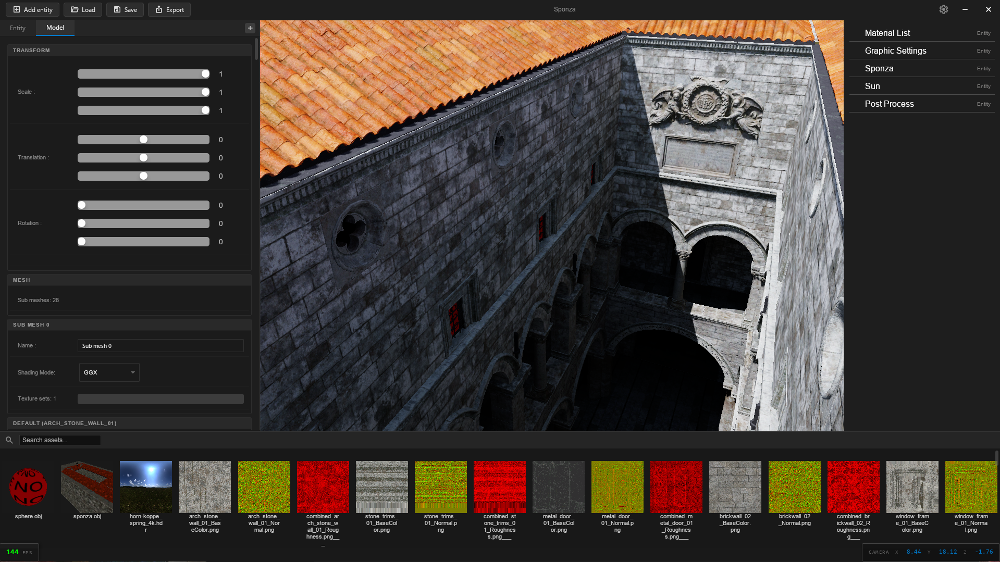
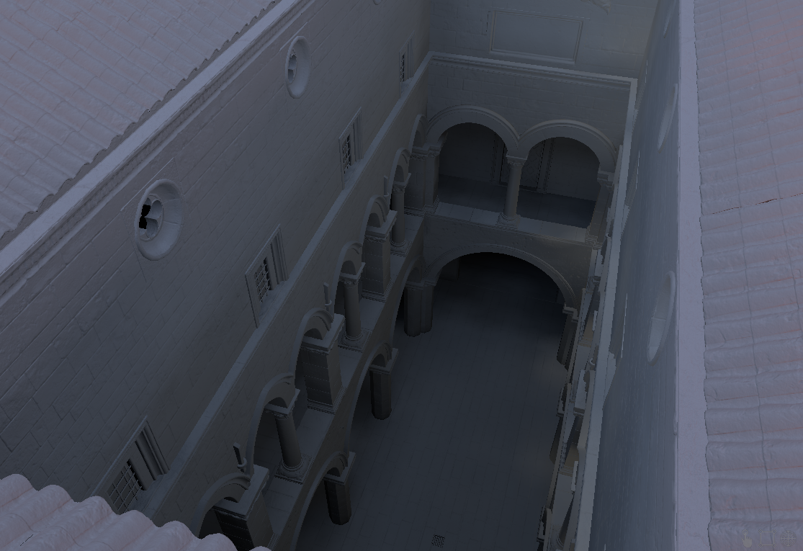
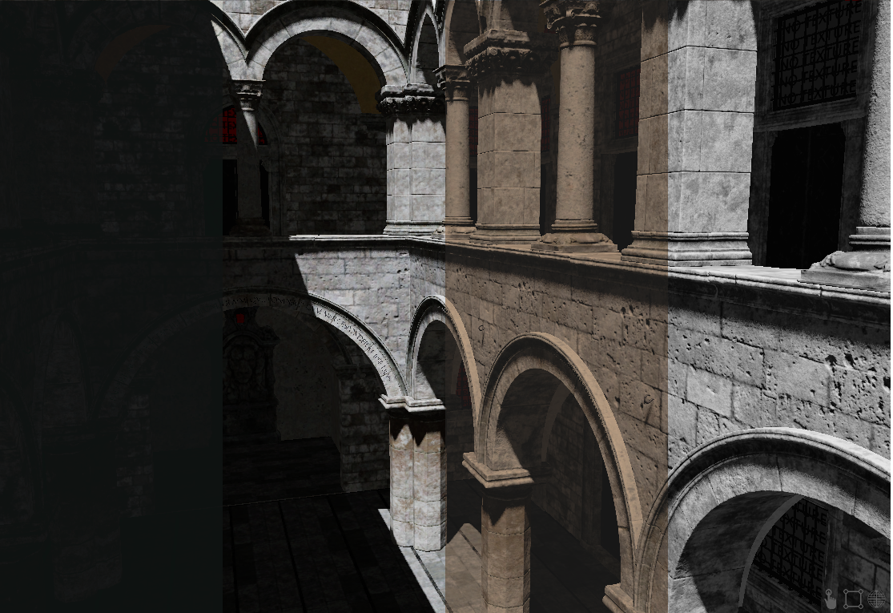
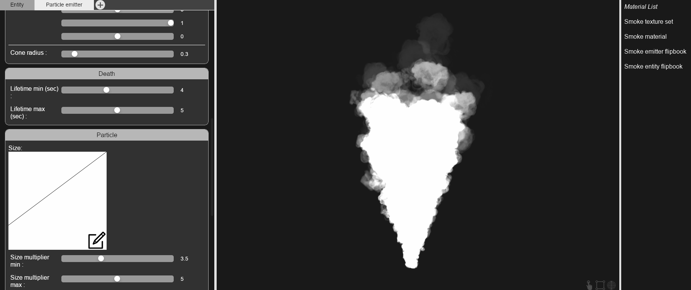
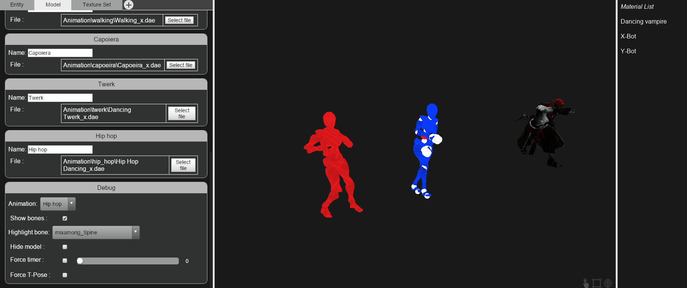

# Wolf-Engine 2.0 - 3D Editor

This project is a 3D editor using the [Wolf-Engine 2.0](https://github.com/arthur-monteiro/WolfEngine-2.0).

<p align="center">
  
</p>

Currently in development.

## Installation

Build with CMake, it will automatically download the right Wolf-Engine version.

## Setup

In `Wolf Engine 2.0 - 3D Editor\config` create a file `editor.ini` with the options:
| Name | Info | Mandatory |
| ---  | --- | --- |
| dataFolder | The folder where you want to store the data | Mandatory |
| defaultScene | Local path (within the `dataFolder`) of the scene to load at startup | Optional |
| enableDebugDraw | 1 or 0 to enable / disable debug draw | Optional |
| enableRayTracing | 1 or 0 to enable / disable ray tracing | Optional |

Each line must define a new option with the syntax `optionName`=`value`

Example:
```
dataFolder=F:\Data
defaultScene=Saves\Scenes\sponza_intel.json
enableDebugDraw=1
enableRayTracing=1
```

## Features

### Ray traced global illumination
Realtime capture of indirect lighting and sky lighting.

<p align="center">
  
</p>


### Color grading
You can load a .cube file (rec709) to apply a "look" on the final image.

<p align="center">
  
</p>

### Particles

<p align="center">
  
</p>

### Animations

<p align="center">
  
</p>

### Texture streaming
Textures are divided into mutliple slices to only load what's visible on screen.

<p align="center">
  
</p>