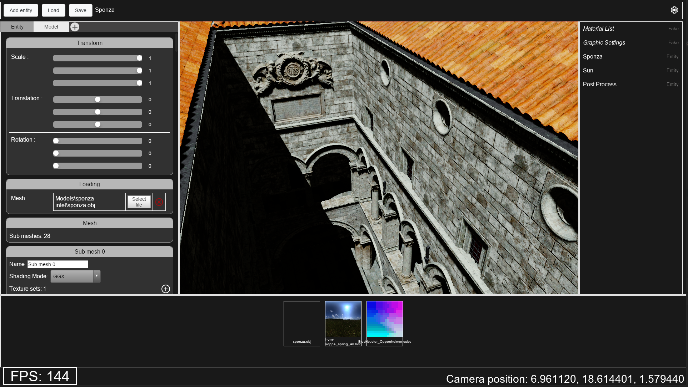

# Wolf-Engine 2.0 - 3D Editor

This project is a 3D editor using the [Wolf-Engine 2.0](https://github.com/arthur-monteiro/WolfEngine-2.0).

  

Currently in development.

## Installation

1. Clone the [Wolf-Engine 2.0](https://github.com/arthur-monteiro/WolfEngine-2.0) and build it
2. Create an environment variable `WOLF_ENGINE_PATH` with the path of the Wolf Engine
3. Run `setup_wolf_engine.bat`
4. If you use visual studio, you can use `Wolf Engine 2.0 - 3D Editor.sln` otherwise you can use the `CMakeLists.txt` in the folder `Wolf Engine 2.0 - 3D Editor`