# Snowy sponza

This scene shows the famous Sponza (https://www.intel.com/content/www/us/en/developer/topic-technology/graphics-research/samples.html) with snow.

  

    Work in progress

# Scene geometry

First of all, we render sponza with a cloudy sky:

  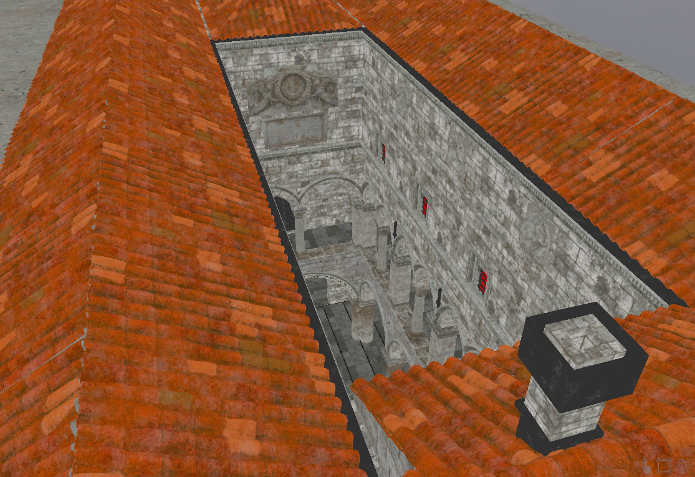
  &nbsp;&nbsp;&nbsp;&nbsp;&nbsp;&nbsp;
  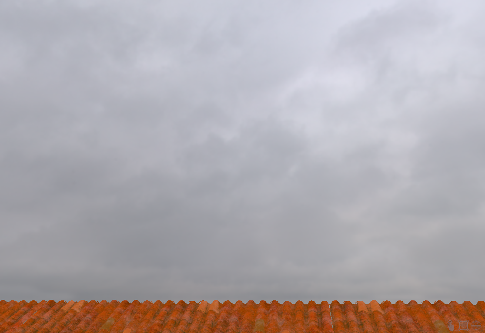

Due to the cloudy sky, direct lighting will no be very useful (as well as shadows), almost all the lighting is done using [ray traced global illumination](voxelGI_README.md)

  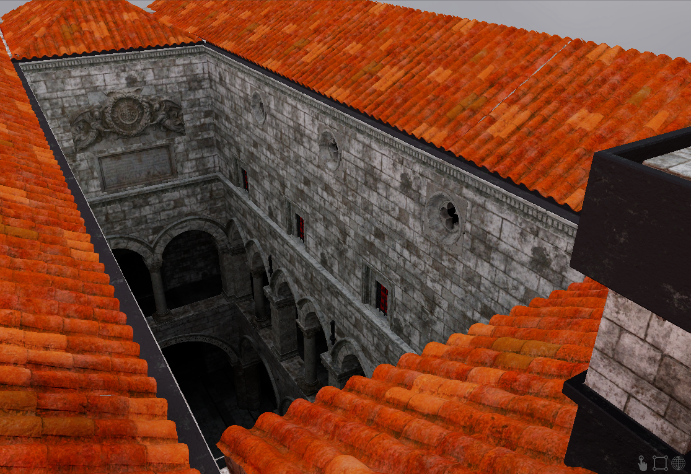

# Particles

The main focus here is the snow. It's done using 160'000 particles randomly spawned in a rectangle 30m above the scene:

  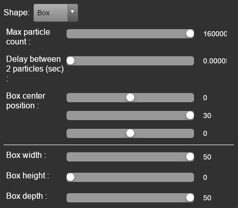
  &nbsp;&nbsp;&nbsp;&nbsp;&nbsp;&nbsp;
  

Particles are lit using the global irradiance system:

  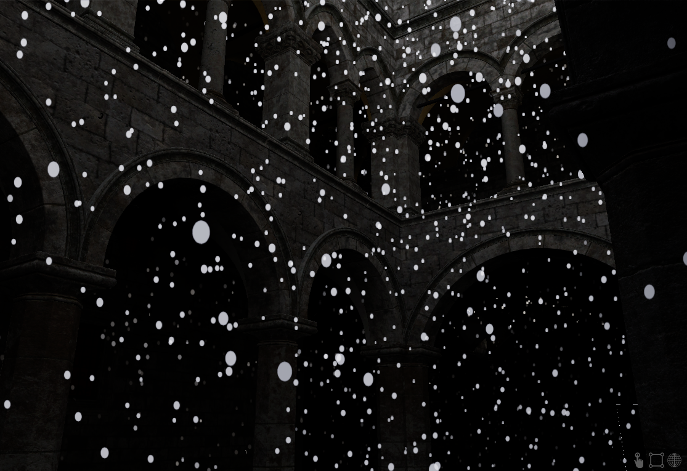

## Collision

An important feature here is particles collision. It's handled by rendering a top-down depth image of the scene and comparing the depths in projection space:

  
  &nbsp;&nbsp;&nbsp;&nbsp;&nbsp;&nbsp;
  

# Snow geometry

The snow is rendered by drawing a tessellated square where all the vertex are computed in shaders.

  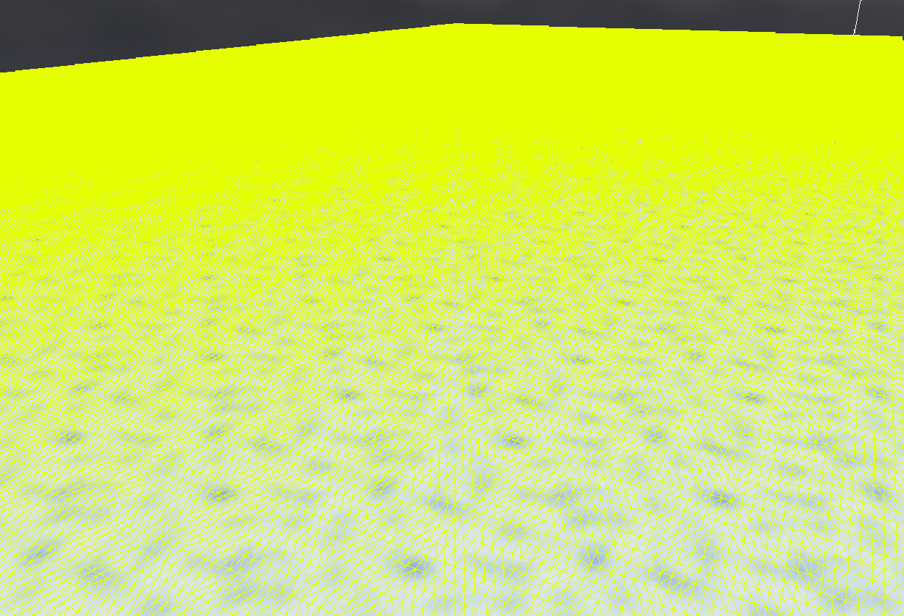

In tessellation evaluation shader, vertices are ajusted to the geometry height using a top-down capture of the scene. Normals are also ajusted:

  
  &nbsp;&nbsp;&nbsp;&nbsp;&nbsp;&nbsp;
  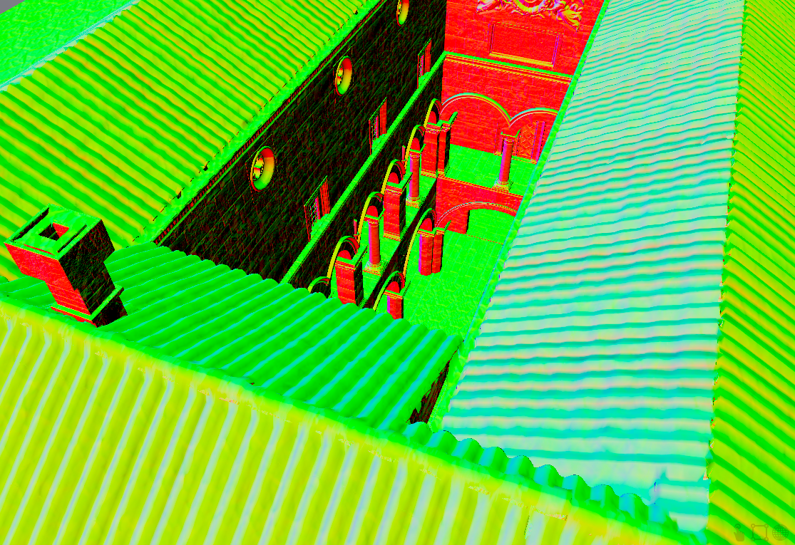

Then to create some little dunes, 4 displacement images are applied on top of the vertices. Modifying height and normals. \
Using multiple patterns is useful to break tiling. From left to right: 1 pattern is used, then 2, ...

  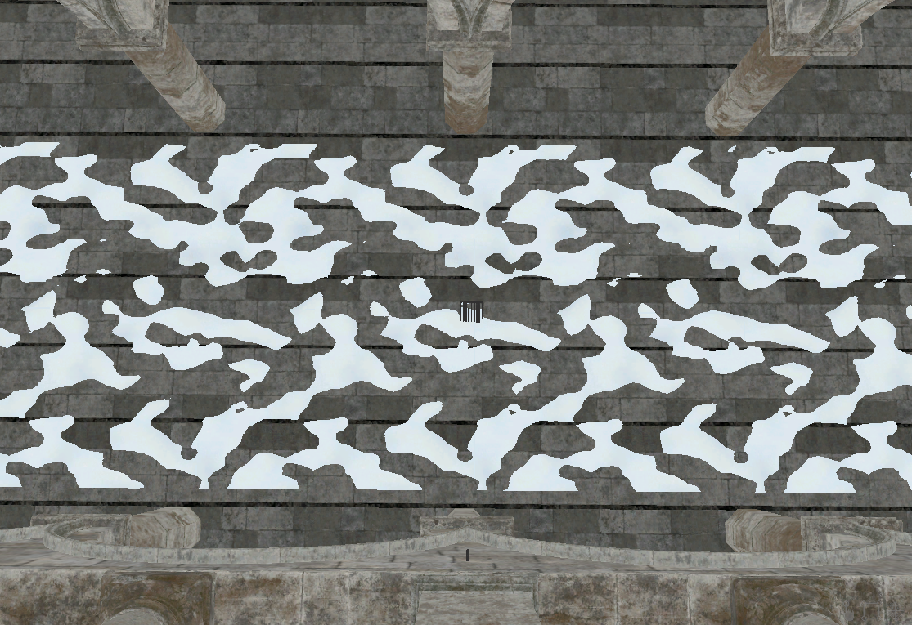
  &nbsp;&nbsp;&nbsp;&nbsp;&nbsp;&nbsp;
  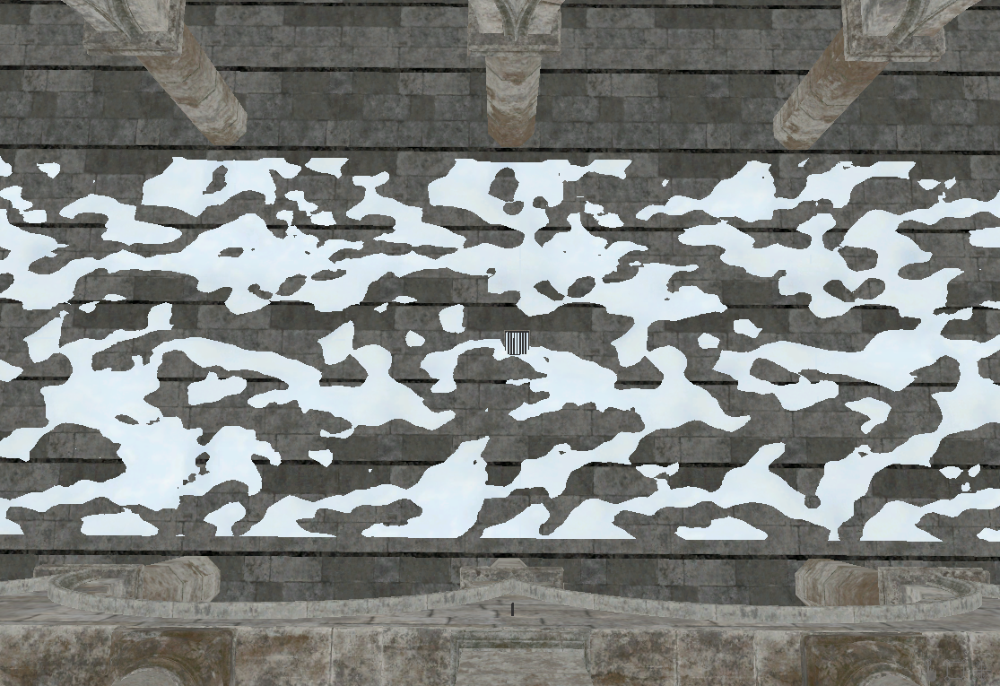
  &nbsp;&nbsp;&nbsp;&nbsp;&nbsp;&nbsp;
  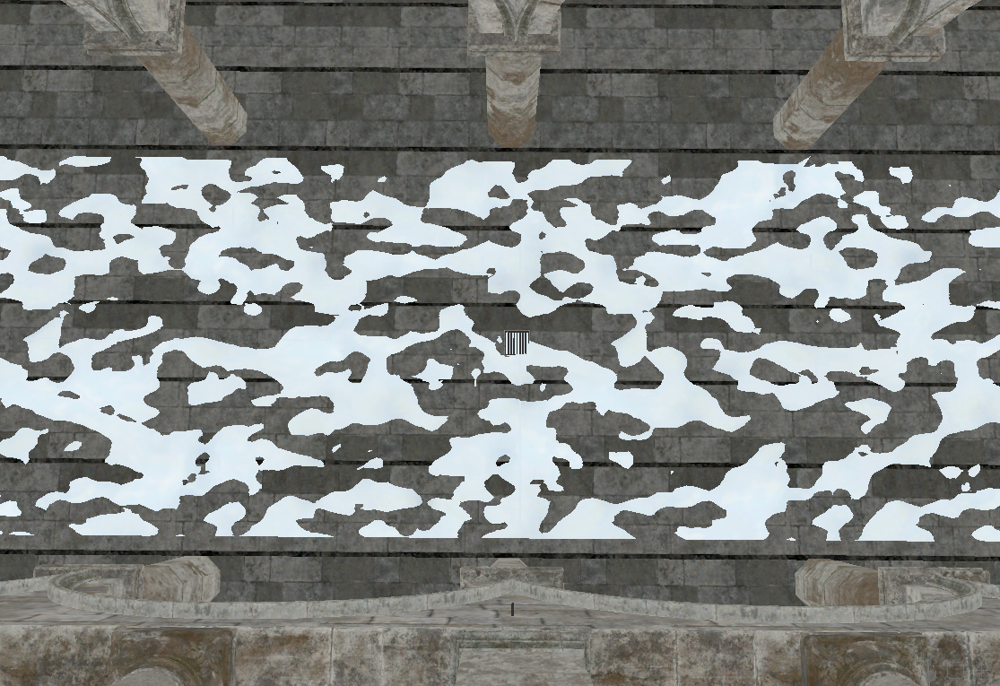
  &nbsp;&nbsp;&nbsp;&nbsp;&nbsp;&nbsp;
  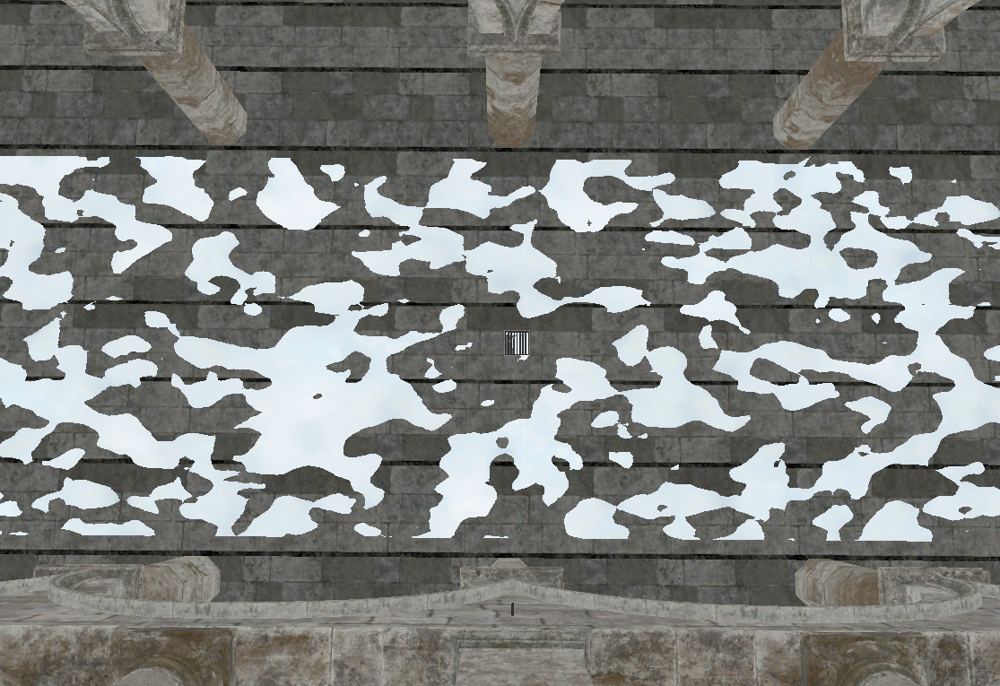

Patterns to sample are chosen using a randomly generated map:

  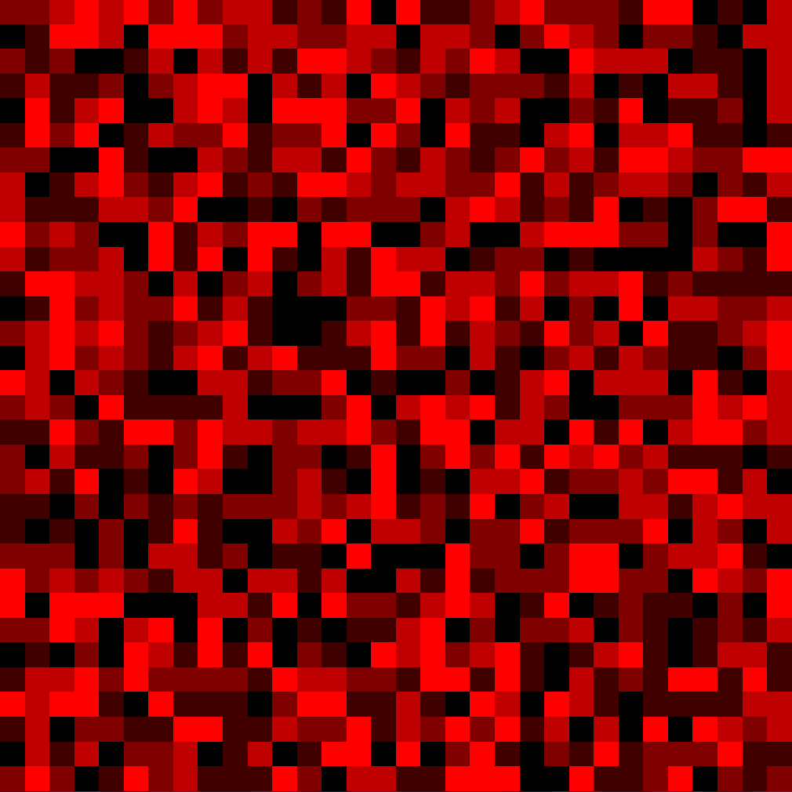

To adapt tessellation level and discard out of frustum patches, and separated pass computes the min and max depth for all the patches:

  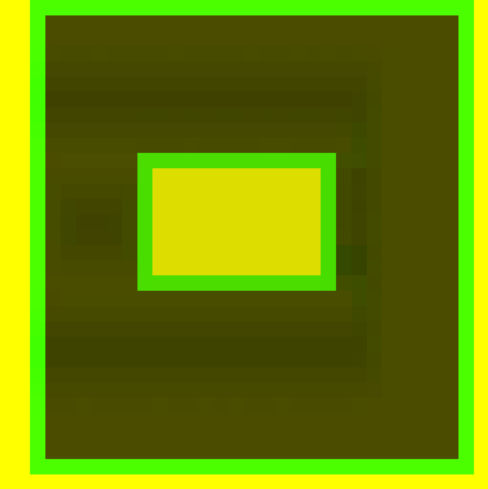
  &nbsp;&nbsp;&nbsp;&nbsp;&nbsp;&nbsp;
  

Global snow height and offset can be controlled with editor parameters:

  

