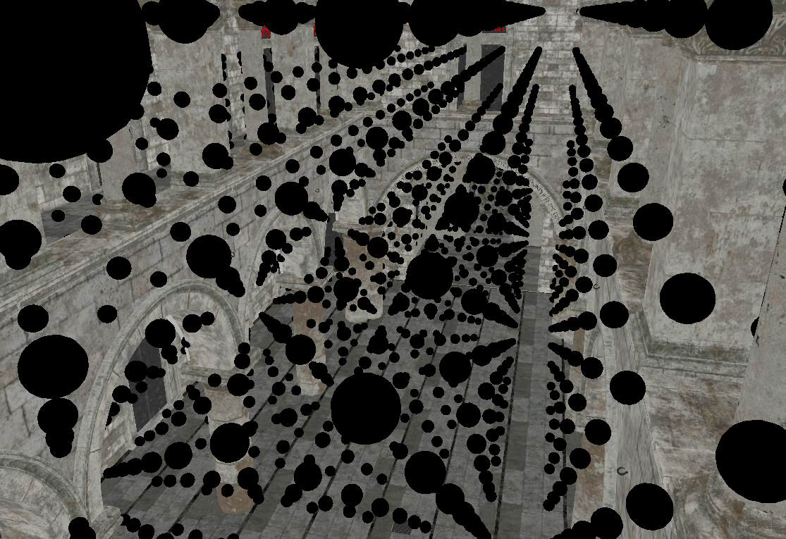
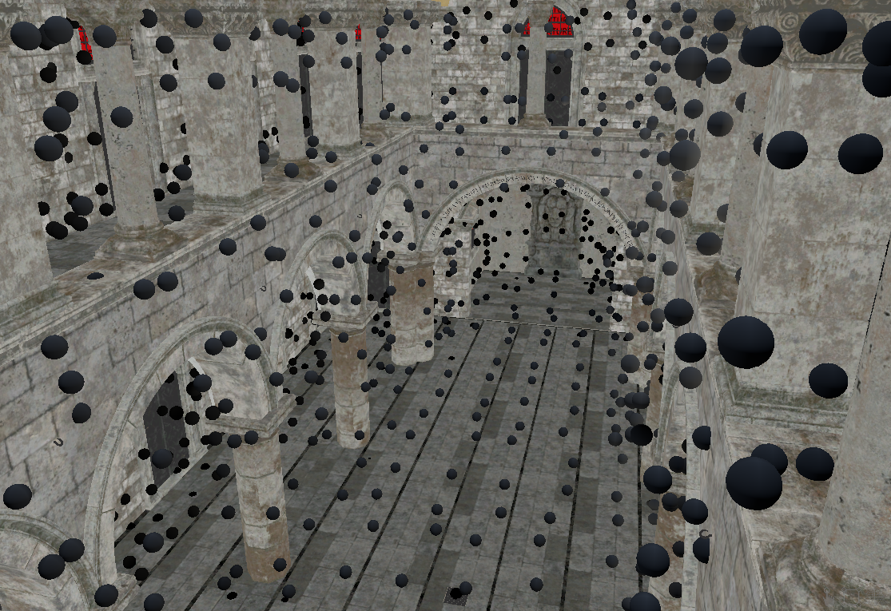
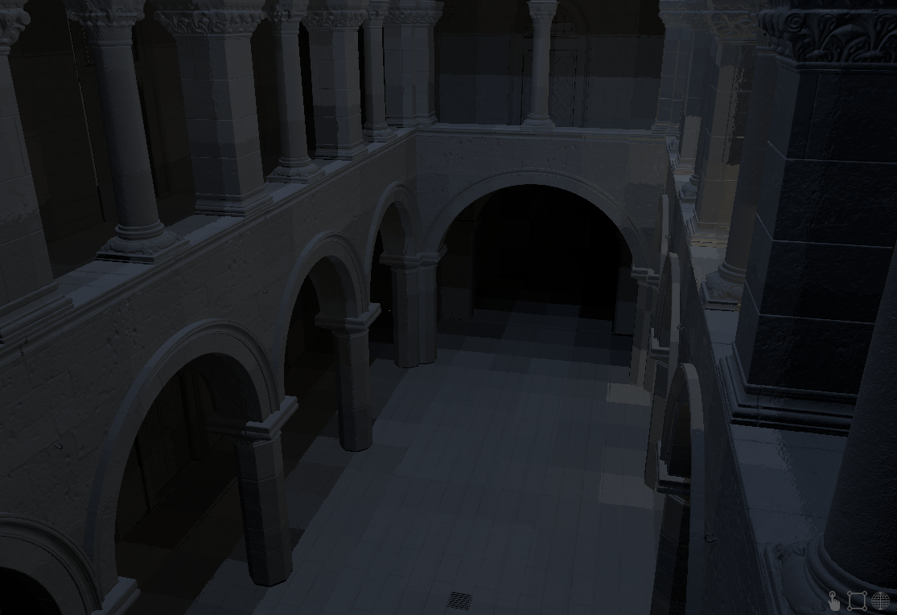
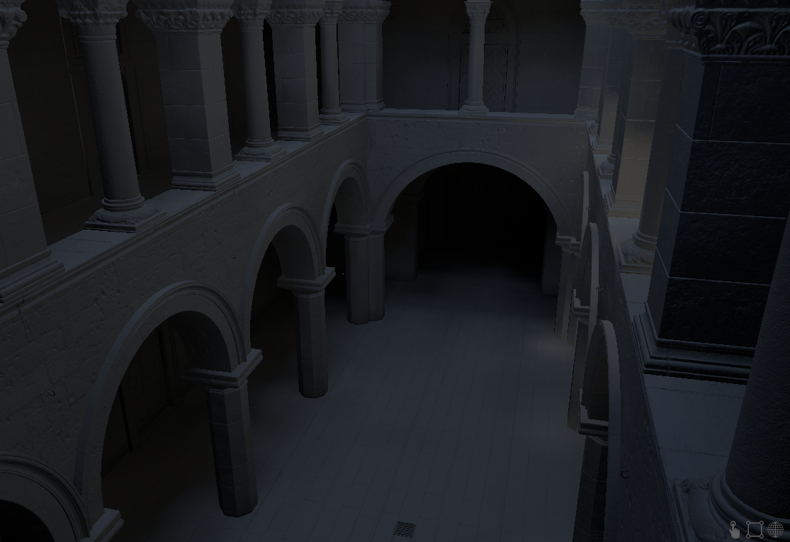
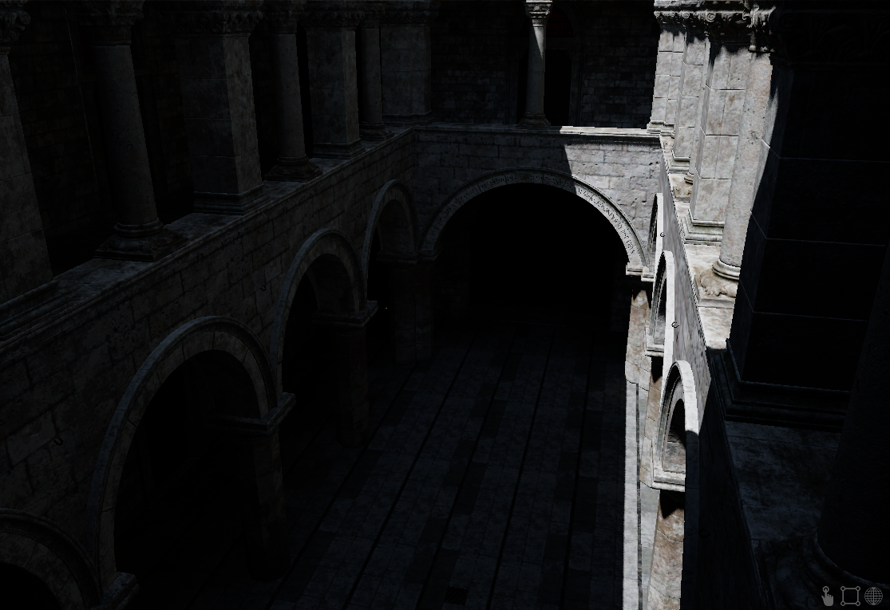
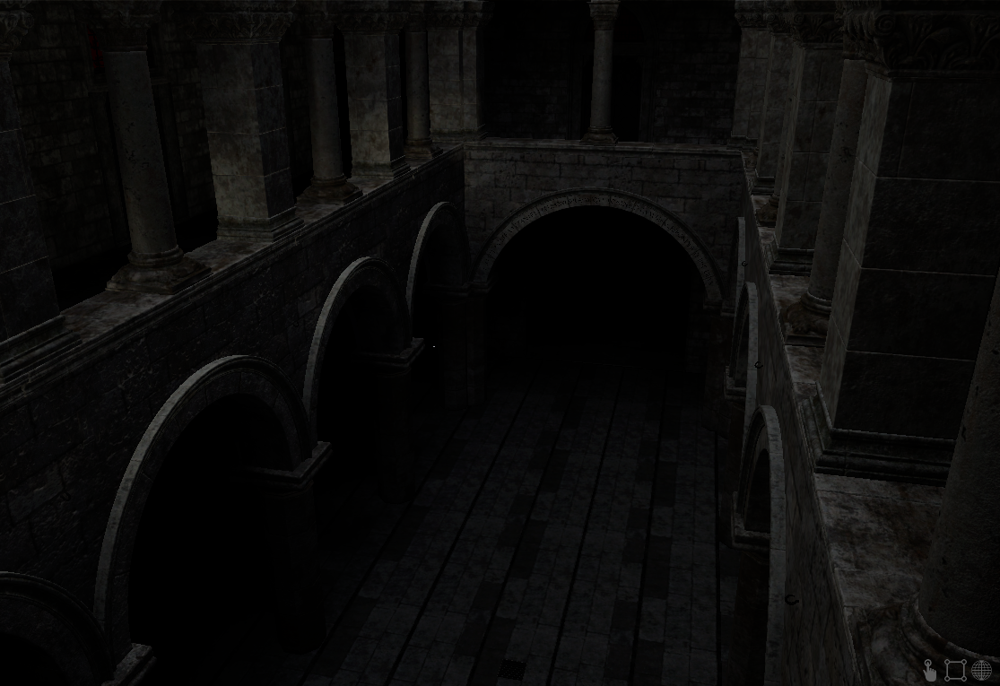

# Real time - Ray traced global illumination

The core of the algorithm relies on a 3D irradiance grid, where each cell contains irradiance information for the 6 faces of a cube.

  

Cell faces are computed only if requested and computation position is adjusted depending on the request.

  

  

Trilinear filtering is performed to avoid seeing "blocky" patterns.

  

Here the result with a sunny environment:

  

And with a cloudy environment:

  

